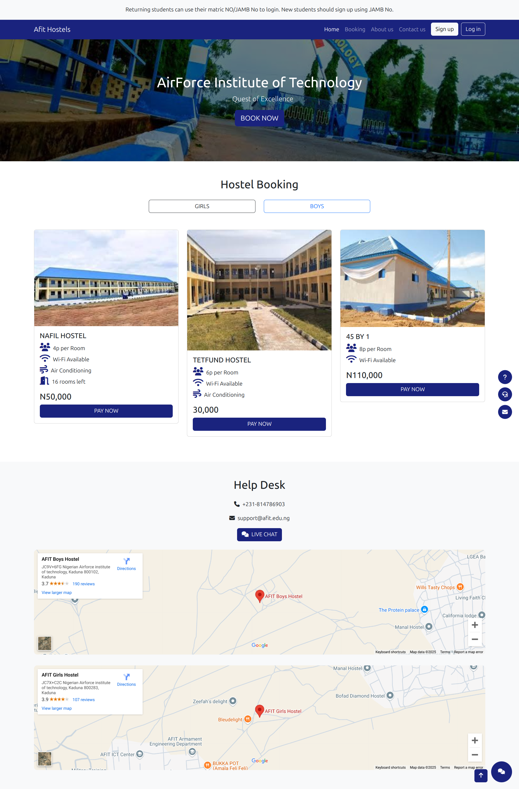

# AFIT Hostel Booking System

A modern hostel booking platform for the Air Force Institute of Technology students.

[
[](https://opensource.org/licenses/MIT)



## Features
- 🏠 Hostel listings with detailed information
- 🚻 Gender-based filtering
- 💳 Payment simulation system
- 📍 Interactive campus map (Leaflet.js)
- 📱 Responsive mobile-first design
- 💬 Live chat support interface

## Technologies Used
- **Frontend**: HTML5, CSS3, JavaScript
- **UI Framework**: Bootstrap 5.3
- **Mapping**: Leaflet.js
- **Icons**: Font Awesome 6
- **Hosting**: GitHub Pages

## Installation
1. Clone the repository:
```bash
git clone https://github.com/rofeeqshittu/hostelBooking.git
```
2. Open index.html in any modern browser

## Contributing
Contributions are welcome! Please:

- Fork the project
- Create your feature branch (git checkout -b feature/AmazingFeature)
- Commit changes (git commit -m 'Add some AmazingFeature')
- Push to the branch (git push origin feature/AmazingFeature)
- Open a Pull Request

## License
- Distributed under the MIT License. See `LICENSE` for more information.
